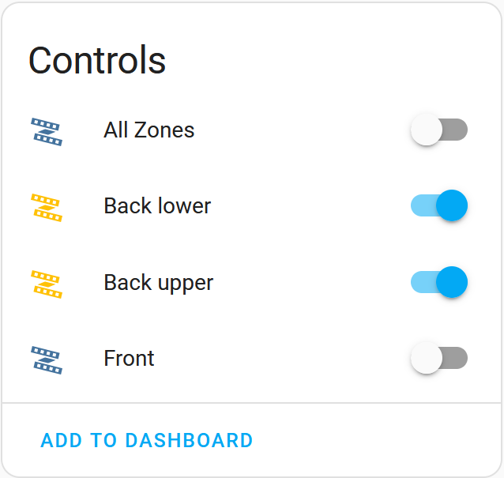
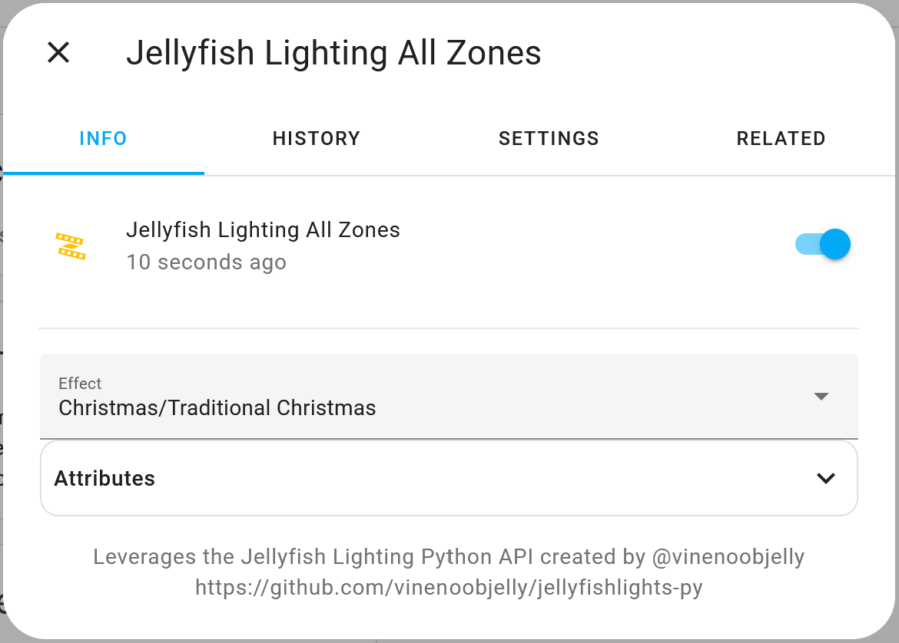

# Jellyfish Lighting for Home Assistant

[![GitHub Release][releases-shield]][releases]
[![GitHub Activity][commits-shield]][commits]
[![License][license-shield]](LICENSE)
[![hacs][hacsbadge]][hacs]
[![Community Forum][forum-shield]][forum]
[![BuyMeCoffee][buymecoffeebadge]][buymecoffee]

This component is designed to integrate with [jellyfish-lighting][jellyfish-lighting] installations. It currently supports turning lights on & off and playing pre-saved patterns. If your installation includes more than one zone you can control each zone individually **or** all zones at once through a dedicated "All Zones" light entity.

| Light Entities for Mulitple Zones | Playing a Pre-Saved Pattern |
| :-------------------------------: | :-------------------------: |
|||

## Installation via HACS

1. Install HACS in your Home Assisstant installation (see https://hacs.xyz/ for detailed instructions)
2. Navigate to HACS within your Home Assistant instance (Menu > HACS)
3. Select "Integrations"
4. In the upper-right hand corner, click the 3-dot menu button and select "Custom Repositories"
5. Paste the link to this repo (https://github.com/bdunn44/hass-jellyfish-lighting) into the "Repository" field, select "Integration" for the category, and click "Add"
6. Search for the "Jellyfish Lighting" integration, open it, and click "Download"
7. Restart Home Assistant
7. In the HA UI go to "Configuration" -> "Integrations" click "+" and search for "Jellyfish Lighting"
8. Enter the host/IP of your Jellyfish Controller.

_**Note:** I am working to get this integration added to the default HACS library. Stay tuned!_

## Manual Installation

1. Using the tool of choice open the directory (folder) for your HA configuration (where you find `configuration.yaml`).
2. If you do not have a `custom_components` directory (folder) there, you need to create it.
3. In the `custom_components` directory (folder) create a new folder called `jellyfish-lighting`.
4. Download _all_ the files from the `custom_components/jellyfish-lighting/` directory (folder) in this repository.
5. Place the files you downloaded in the new directory (folder) you created.
6. Restart Home Assistant
7. In the HA UI go to "Configuration" -> "Integrations" click "+" and search for "Jellyfish Lighting"
8. Enter the host/IP of your Jellyfish Controller.

**_Note: it is highly recommended to set a static IP for your controller if you haven't already!_**

[jellyfish-lighting]: https://jellyfishlighting.com/
[commits-shield]: https://img.shields.io/github/commit-activity/y/custom-components/blueprint.svg?style=for-the-badge
[commits]: https://github.com/bdunn44/hass-jellyfish-lighting/commits/master
[hacs]: https://github.com/hacs/integration
[hacsbadge]: https://img.shields.io/badge/HACS-Default-41BDF5.svg?style=for-the-badge
[forum-shield]: https://img.shields.io/badge/community-forum-brightgreen.svg?style=for-the-badge
[forum]: https://community.home-assistant.io/
[license-shield]: https://img.shields.io/github/license/custom-components/blueprint.svg?style=for-the-badge
[releases-shield]: https://img.shields.io/github/release/custom-components/blueprint.svg?style=for-the-badge
[releases]: https://github.com/bdunn44/hass-jellyfish-lighting/releases
[buymecoffee]: https://www.buymeacoffee.com/bdunn44
[buymecoffeebadge]: https://img.shields.io/badge/buy%20me%20a%20coffee-donate-yellow.svg?style=for-the-badge

[example-zones]: example_zones.png
[example-play-pattern]: example_play_pattern.png
