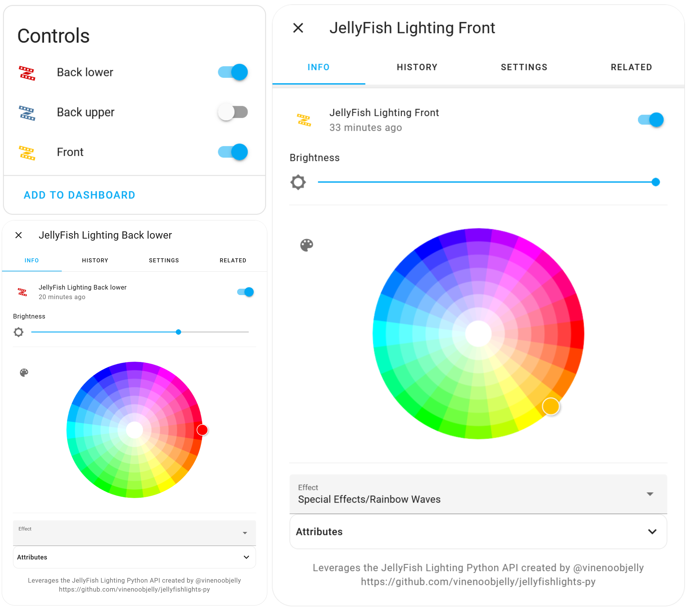

#  JellyFish Lighting for Home Assistant

[![GitHub Release][releases-badge]][releases]
[![GitHub Activity][commits-badge]][commits]
![downloads][downloads-badge]
[![License][license-badge]](LICENSE)
[![hacs][hacsbadge]][hacs]
[![Community Forum][forum-badge]][forum]
[![BuyMeCoffee][buymecoffee-badge]][buymecoffee]

This component is designed to integrate with [JellyFish Lighting][jellyfish-lighting] installations. It currently supports turning lights on & off, setting solid colors with brightness control, and playing pre-saved patterns. If your installation includes more than one zone you can control each zone individually.

This is an unofficial integration that has not been developed or endorsed by JellyFish Lighting.

## Installation (the easy way)

If you've already installed HACS (https://hacs.xyz/), simply click this button!

## Installation (via HACS)

1. Install HACS in your Home Assisstant installation (see https://hacs.xyz/ for detailed instructions)
1. Navigate to HACS within your Home Assistant instance (Menu > HACS)
1. Select "Integrations"
1. Search for the "JellyFish Lighting" integration, open it, and click "Download"
1. Restart Home Assistant
1. In the HA UI go to "Configuration" -> "Integrations" click "+" and search for "JellyFish Lighting"
1. Enter the host/IP of your JellyFish Controller.

_**Note:** it is highly recommended to set a static IP for your controller if you haven't already!_

## Manual Installation

1. Using the tool of choice open the directory (folder) for your HA configuration (where you find `configuration.yaml`).
1. If you do not have a `custom_components` directory (folder) there, you need to create it.
1. In the `custom_components` directory (folder) create a new folder called `jellyfish_lighting`.
1. Download _all_ the files from the `custom_components/jellyfish_lighting/` directory (folder) in this repository.
1. Place the files you downloaded in the new directory (folder) you created.
1. Restart Home Assistant
1. In the HA UI go to "Configuration" -> "Integrations" click "+" and search for "JellyFish Lighting"
1. Enter the host/IP of your Jellyfish Controller.

_**Note:** it is highly recommended to set a static IP for your controller if you haven't already!_

## Trademark Legal Notices

All product names, trademarks and registered trademarks in the images in this
repository, are property of their respective owners. All images in this
repository are used by the project for identification purposes
only.

The use of these names, trademarks and brands appearing in these image files,
do not imply endorsement.

[jellyfish-lighting]: https://jellyfishlighting.com/
[commits-badge]: https://img.shields.io/github/commit-activity/y/bdunn44/hass-jellyfish-lighting?style=flat-square
[commits]: https://github.com/bdunn44/hass-jellyfish-lighting/commits/master
[releases]: https://github.com/bdunn44/hass-jellyfish-lighting/releases
[downloads-badge]: https://img.shields.io/github/downloads/bdunn44/hass-jellyfish-lighting/total?style=flat-square
[hacs]: https://github.com/hacs/integration
[hacsbadge]: https://img.shields.io/badge/hacs-default-orange.svg?style=flat-square
[forum-badge]: https://img.shields.io/badge/community-forum-yellow.svg?style=flat-square
[forum]: https://community.home-assistant.io/
[license-badge]: https://img.shields.io/github/license/bdunn44/hass-jellyfish-lighting?style=flat-square
[releases-badge]: https://img.shields.io/github/v/release/bdunn44/hass-jellyfish-lighting?include_prereleases&style=flat-square
[buymecoffee]: https://www.buymeacoffee.com/bdunn44
[buymecoffee-badge]: https://img.shields.io/badge/buy%20me%20a%20coffee-donate-yellow.svg?style=flat-square

[example-zones]: example_zones.png
[example-play-pattern]: example_play_pattern.png
